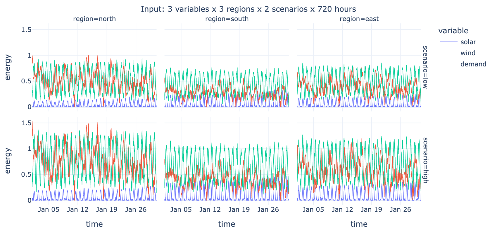
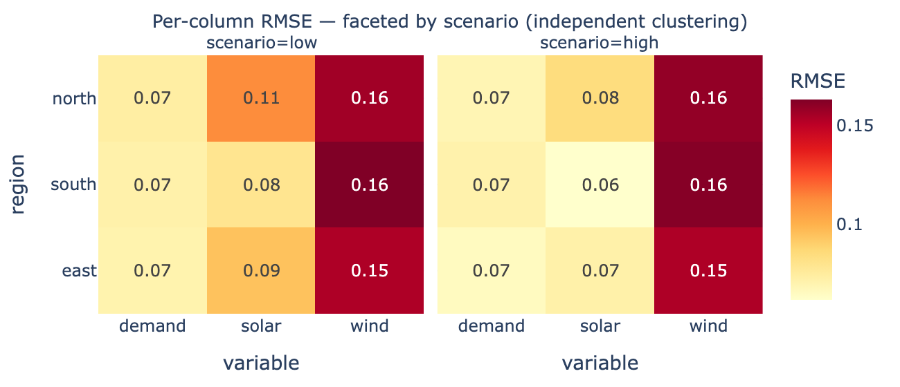

# tsam_xarray

[](https://pypi.org/project/tsam-xarray/)
[](https://pypi.org/project/tsam-xarray/)
[](https://github.com/FBumann/tsam_xarray/actions/workflows/ci.yaml)
[](https://codecov.io/gh/FBumann/tsam_xarray)
[](LICENSE)
[](https://tsam-xarray.readthedocs.io/)

**DataArray in, DataArray out** — multi-dimensional time series aggregation with [tsam](https://github.com/FZJ-IEK3-VSA/tsam) and [xarray](https://xarray.dev/).

## The problem

Energy system data is multi-dimensional — variables, regions, scenarios, years. Some dimensions should be **clustered together** (solar and wind profiles in the same region should see the same typical days), while others need **independent clustering** (each scenario has its own weather patterns).



tsam works on flat DataFrames. With multi-dimensional data, you end up writing boilerplate: loop over scenarios, convert to DataFrame, aggregate, extract results, convert back, concatenate, hope the dims line up. Accuracy metrics come back as unlabeled `pd.Series`. Saving a clustering means managing raw dicts.

## The solution

```python
import tsam_xarray

result = tsam_xarray.aggregate(
    da,                                    # (time, variable, region, scenario)
    time_dim="time",
    cluster_dim=["variable", "region"],    # clustered together
    n_clusters=4,
)
# scenario is sliced independently — each gets its own clustering
```

Everything comes back as labeled xarray objects:

```python
result.cluster_representatives   # (scenario, cluster, timestep, variable, region)
result.reconstructed             # same shape as input
result.cluster_assignments       # (scenario, period)
```

Accuracy metrics preserve all dimensions — see exactly where the approximation is good or bad:



```python
result.accuracy.rmse             # DataArray (scenario, variable, region)
result.accuracy.weighted_rmse    # DataArray (scenario,) — per-slice summary
```

## Save, load, reuse

```python
# Save clustering (not the data — just the mapping)
result.clustering.to_json("clustering.json")

# Load and inspect — no original data needed
clustering = tsam_xarray.load_clustering("clustering.json")
clustering.n_clusters              # 4
clustering.cluster_assignments     # DataArray (scenario, period)
clustering.cluster_occurrences     # DataArray (scenario, cluster)

# Apply to new data or disaggregate optimization results
new_result = clustering.apply(new_da)
full_timeseries = clustering.disaggregate(optimized_data)
```

## Tuning

Find optimal hyperparameters across all slices:

```python
grid = tsam_xarray.grid_search(
    da,
    time_dim="time",
    cluster_dim=["variable", "region"],
    timesteps=np.geomspace(2, 48, num=12, dtype=int),  # sparse search
)
grid.summary_matrix["rmse"]        # heatmap-ready (n_clusters, n_segments)
grid.accuracy["weighted_rmse"]     # per-slice weighted RMSE for every config
```

## Installation

```bash
pip install tsam-xarray
```

## Documentation

Full docs with interactive examples: **[tsam-xarray.readthedocs.io](https://tsam-xarray.readthedocs.io/)**
