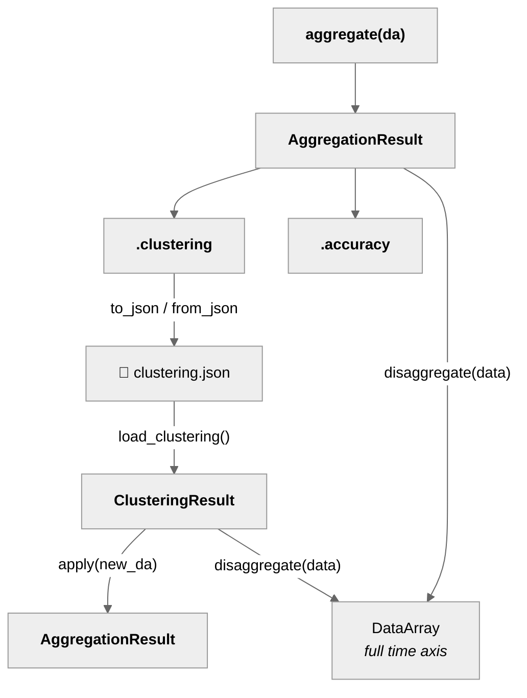
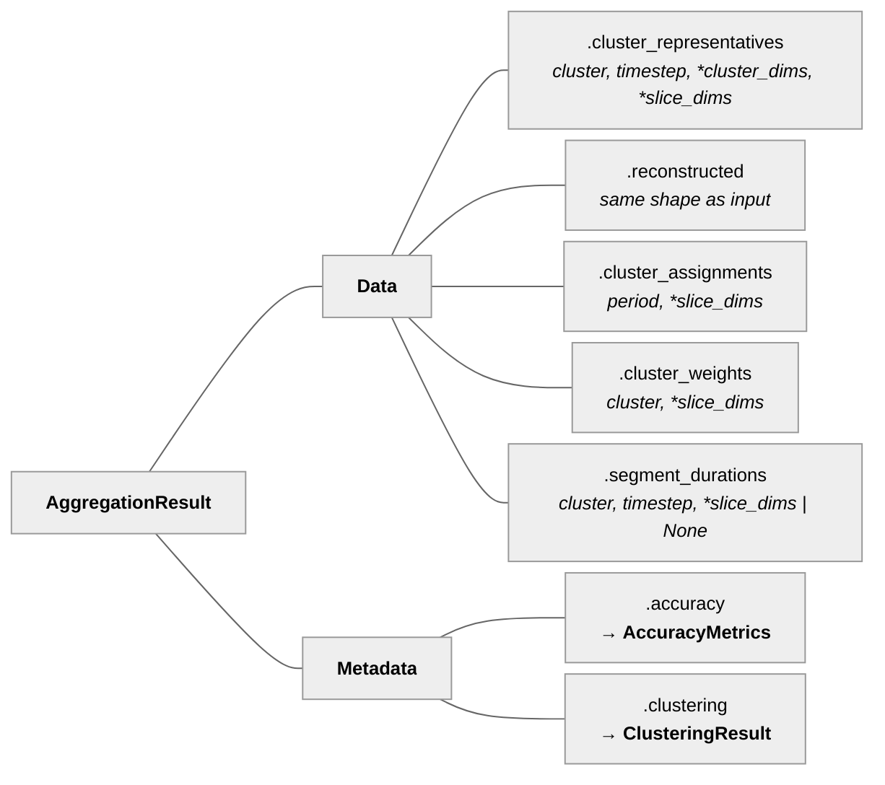
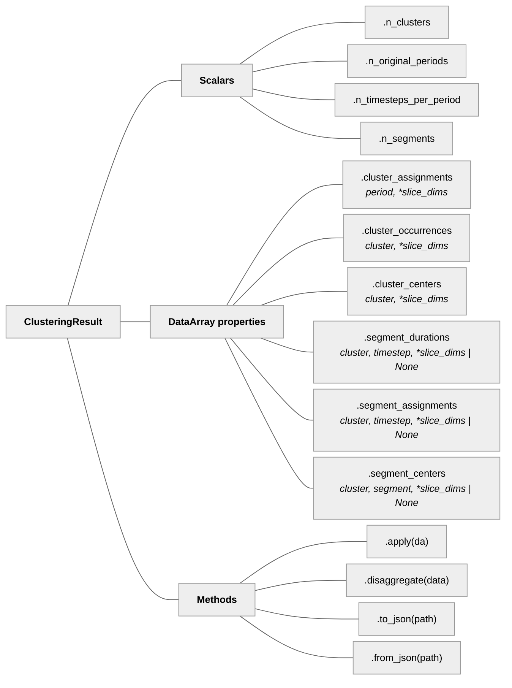

# Data Model

## Object relationships

## AggregationResult

Returned by `aggregate()`. Contains everything about one aggregation.

## ClusteringResult

The reusable part — knows *how* the time series was clustered,
without the original data. Access via `result.clustering` or
`load_clustering("clustering.json")`.

All DataArray properties are **cached** on first access.

## AccuracyMetrics

Per-column metrics as DataArrays, plus weighted scalars.

| Field | Type | Description |
|-------|------|-------------|
| `rmse` | DataArray | Per-column RMSE |
| `mae` | DataArray | Per-column MAE |
| `rmse_duration` | DataArray | Per-column duration-curve RMSE |
| `weighted_rmse` | float | Scalar RMSE weighted by column weights |
| `weighted_mae` | float | Scalar MAE weighted by column weights |
| `weighted_rmse_duration` | float | Scalar duration RMSE weighted by column weights |

## Glossary

| Term | Meaning |
|------|---------|
| **cluster_dim** | Dimensions clustered together (stacked internally) |
| **slice_dims** | Dimensions aggregated independently |
| **period** | One repeating unit of time (e.g., one day) |
| **cluster** | A group of similar periods |
| **timestep** | Position within a period (e.g., hour 0-23) |
| **segment** | A contiguous block of timesteps (with segmentation) |
